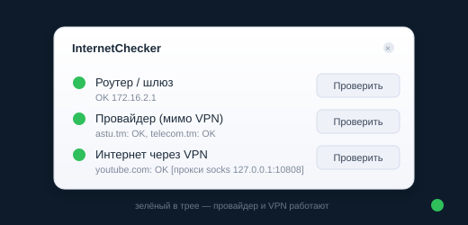
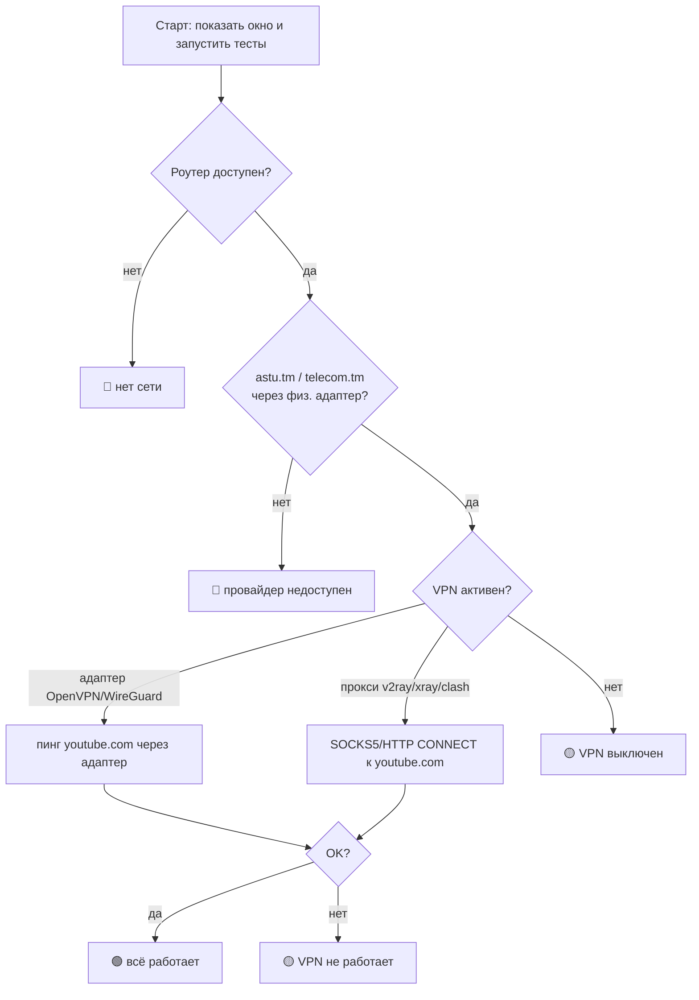

<div align="center">

# 🌐 InternetChecker

**Крошечная утилита для трея, которая одним взглядом показывает: жив ли интернет от провайдера — и работает ли ваш VPN.**
_Сделано под реалии Туркменистана: провайдер проверяется в обход VPN, VPN — до YouTube._


### [⬇️ Скачать последнюю версию](https://github.com/MerdanOchanov/VpnAndInternetCheckerForTm/releases/latest)



</div>

---

## Зачем это нужно

Когда включён VPN, обычная проверка «пингани 8.8.8.8» ничего не говорит: если VPN‑туннель
завис, пинг просто уходит в никуда, и непонятно — **провайдер упал или VPN?**
InternetChecker разделяет это на три независимых индикатора:

| Индикатор | Что проверяет | Как |
|-----------|---------------|-----|
| 🟢 **Роутер / шлюз** | доступен ли домашний роутер | ICMP‑пинг до шлюза физического адаптера |
| 🟢 **Провайдер (мимо VPN)** | жив ли интернет от провайдера, **в обход VPN** | `astu.tm` / `telecom.tm` через физический канал |
| 🟢 **Интернет через VPN** | проходит ли трафик через VPN | `youtube.com` через туннель **или прокси** |

Значок в трее меняет цвет: 🟢 всё работает · 🟡 провайдер жив, VPN нет · 🔴 нет интернета от провайдера.

---

## Логика проверок



---

## Поддерживаемые виды VPN

- **Прокси‑VPN** (v2ray / Xray / Clash / sing‑box и т.п.) — определяется по системному прокси
  (WinINET) **или** пробингом локальных портов (`10808, 1080, 7890, …`), даже если системный
  прокси не задан. Проверка идёт настоящим `SOCKS5` / `HTTP CONNECT` до YouTube.
- **Адаптерные VPN** (OpenVPN, WireGuard, sing‑box TUN, …) — определяются по сетевому
  адаптеру с рабочим IP. Мёртвые `169.254.x` (APIPA) адаптеры игнорируются.

---

## Установка

Все сборки — на странице **[Releases](https://github.com/MerdanOchanov/VpnAndInternetCheckerForTm/releases/latest)**.

**Вариант 1 — установщик (рекомендуется).** Скачайте **InternetChecker.msi** и запустите.
Установщик **сам закрывает старую запущенную версию** и переустанавливает поверх, ставит ярлык
в меню «Пуск». Совместим с Windows 7 SP1 / 10 / 11.

**Вариант 2 — портативная версия.** Скачайте **InternetChecker-portable.zip**, распакуйте, запустите
`InternetChecker.exe` (рядом должен лежать `internetchecker.cfg`). Либо возьмите только
**InternetChecker.exe** отдельным файлом — конфиг создастся сам при первом изменении настроек.

> Нужен **.NET Framework 4.x** — на Windows 10/11 уже встроен; на Windows 7 поставьте .NET Framework 4.8.

---

## Использование

- Программа **при запуске открывает окно и сразу прогоняет все тесты**, затем сворачивается в трей.
- **Левый клик** по значку — показать/скрыть виджет. **Правый клик** — меню (проверить, автозапуск,
  **ярлык на рабочий стол**, настройки, выход).
- Кнопка закрытия окна (✕) прячет его в трей, программа продолжает работать.
- Установщик сам создаёт ярлыки в меню «Пуск» **и на рабочем столе**; в трее есть пункт
  «Ярлык на рабочий стол» для портативной версии.

### Права администратора

Когда «настоящий» VPN (OpenVPN/WireGuard) забирает шлюз по умолчанию, честный пинг до
`astu.tm`/`telecom.tm` мимо VPN возможен только через временный маршрут — а это требует прав админа:

- **От администратора** — добавляется и тут же удаляется временный host‑маршрут, идёт настоящий ICMP‑пинг (`[точный пинг]`).
- **Без администратора** — провайдер определяется по DNS‑резолвингу его узлов через роутер (`DNS‑OK*`). В меню трея есть пункт «Перезапустить от администратора».

Для прокси‑VPN (v2ray/xray) права администратора не нужны — маршруты не трогаются.

---

## Настройки (`internetchecker.cfg`)

| Параметр | По умолчанию | Описание |
|----------|--------------|----------|
| `providerTargets` | `astu.tm,telecom.tm` | узлы провайдера для проверки мимо VPN |
| `vpnTarget` | `youtube.com` | узел для проверки через VPN |
| `intervalSec` | `15` | интервал авто‑проверки |
| `timeoutMs` | `3000` | таймаут одной проверки |
| `vpnHints` | `TAP,WireGuard,OpenVPN,…` | признаки VPN‑адаптеров |
| `proxyProbePorts` | `10808,1080,7890,…` | локальные порты прокси (v2ray/xray/clash) |
| `autostart` | `false` | автозапуск с Windows |

---

## Как это устроено (технически)

- **Обход VPN на уровне сокета:** каждый запрос жёстко привязан к нужному адаптеру через
  `IP_UNICAST_IF` + bind адреса‑источника, поэтому трафик идёт по выбранному каналу независимо
  от таблицы маршрутов.
- **Пинг с указанием источника:** `IcmpSendEcho2Ex` (WinAPI) — пинг без прав администратора.
- **DNS в обход VPN:** собственный UDP DNS‑запрос к DNS роутера, привязанный к физическому адаптеру.
- **Провайдер при активном туннеле:** временный host‑маршрут через `route add` (под админом).
- **Прокси‑VPN:** прямая реализация `SOCKS5` и `HTTP CONNECT` без внешних библиотек.

Весь код — один файл [`Program.cs`](Program.cs), собирается **встроенным** компилятором Windows,
без Visual Studio.

---

## Сборка из исходников

```powershell
# соберёт exe, портативный zip и MSI
powershell -ExecutionPolicy Bypass -File .\build\build.ps1 -Version 1.0.0
```

Требуется только Windows с .NET Framework 4.x (компилятор `csc.exe` уже в системе).
MSI собирается через Windows Installer COM API ([`build/build-msi.vbs`](build/build-msi.vbs)) — тоже без сторонних инструментов.

---

## Структура репозитория

```
Program.cs            — весь исходный код приложения
internetchecker.cfg   — конфигурация по умолчанию
build/build.ps1       — сборка exe + zip + msi
build/build-msi.vbs   — авторинг MSI (major‑upgrade + закрытие старой версии)
dist/                 — готовые InternetChecker.msi и портативный zip
docs/widget.svg       — макет виджета
ТЗ.md                 — техническое задание
```

---

## Лицензия

[MIT](LICENSE) © 2026 Merdan Ochanov
